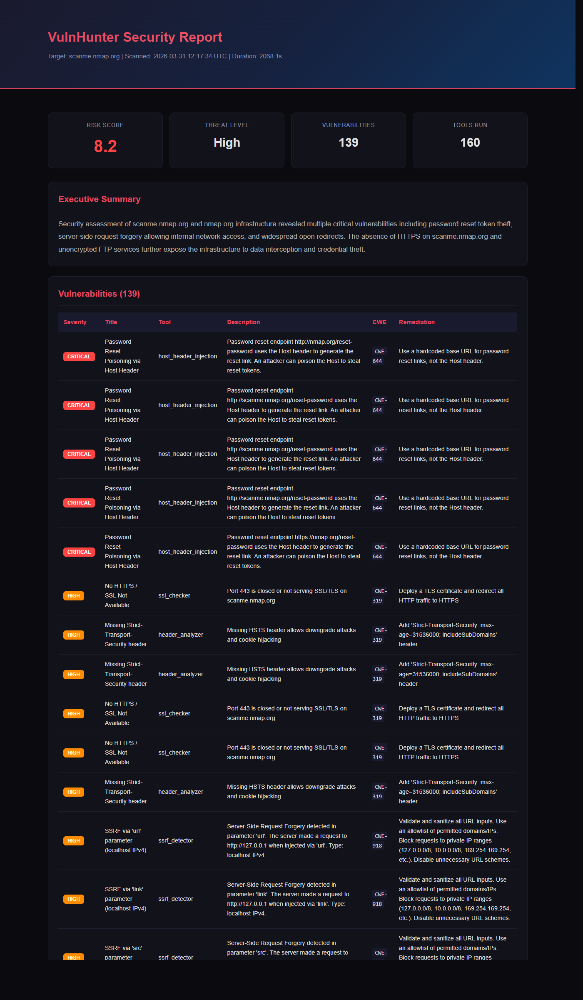

# VulnHunter

**Autonomous, AI-assisted security assessment platform** that coordinates reconnaissance, analysis, and reporting through a multi-agent pipeline. It combines Python-native checks with optional **Docker-sandboxed** professional scanners, then uses an LLM to reason over findings, map risks, and produce structured reports.

Use it for **authorized** penetration tests, bug bounty programs (with scope files), internal staging reviews, or **CI** gates via JSON/SARIF and the included GitHub Action.

---

## What it does

- **Orchestrated workflow**: An orchestrator drives phases (init → recon → analysis → reporting) and delegates to specialized agents (recon, planner-style tasking, exploit-oriented analysis, monitoring, reporting).
- **Many tools in one CLI**: Dozens of built-in tools (see below) plus optional heavy hitters (Nmap, Nuclei, ffuf, sqlmap, etc.) when Docker is available.
- **Rich output**: Console summary with risk score, vulnerability tables, **MITRE ATT&CK** mapping, **attack-chain** analysis, HTML + JSON reports, optional **PDF**, and **bug-bounty-style** report helpers.
- **Web UI**: `vulnhunter ui` starts a dashboard (default `http://127.0.0.1:8477`) backed by FastAPI.
- **Enterprise-friendly extras**: Optional PostgreSQL + pgvector for memory/embeddings, JWT auth hooks, scope YAML for program boundaries, rate limiting / stealth-oriented behavior, WAF detection utilities.

---

## Screenshots & demo assets

Static demos and captures live under **[`docs/assets/`](docs/assets/)**:

| Asset | Purpose |
|--------|---------|
| `report-preview.png` | Screenshot of the HTML security report (ideal for the top of this README once committed) |
| `vulnhunter_scanme.nmap.org_*.html` / `.json` | Sample scan output against the public demo host **scanme.nmap.org** |

Regenerate a sample report or screenshot using the commands in [`docs/assets/README.md`](docs/assets/README.md).




---

## Tools

### Python-native tools (no Docker)

These run in-process and are used in **`--lightweight`** mode:

| Category | Tools |
|----------|--------|
| **Network / DNS / TLS** | Port scanner, DNS enumeration, SSL/TLS checker, WHOIS |
| **HTTP / app surface** | Header analyzer, web scraper, directory bruteforce, web vulnerability checks, tech fingerprinting |
| **Intel / OSINT** | Shodan search (API key), search-engine helper, CVE lookup |
| **Recon pipeline** | Subdomain enumeration, URL harvester, JavaScript analyzer, parameter discovery |
| **Misconfiguration / logic** | Subdomain takeover check, CORS check, SSRF / IDOR / host-header / access-control helpers, GraphQL tests |

### Professional tools (Docker sandbox)

When the sandbox is configured, the orchestrator can also invoke:

| Tool | Role |
|------|------|
| **Nmap** | Network / service discovery |
| **Nuclei** | Template-based vulnerability scanning |
| **ffuf** | Fuzzing / content discovery |
| **sqlmap** | SQL injection testing |
| **Nikto** | Web server misconfiguration checks |
| **httpx** | HTTP probing / fingerprinting |
| **subfinder** | Subdomain enumeration |
| **katana** | Crawling |

---

## Quick start

**Requirements**: Python **3.11+**, an LLM API key (OpenAI-compatible providers supported — see `.env.example`), and optionally Docker for pro tools.

```bash
cd vulnhunter
python -m venv .venv
.venv\Scripts\activate   # Windows
# source .venv/bin/activate  # Linux/macOS

pip install -e .

copy .env.example .env   # Windows — then edit .env
# cp .env.example .env     # Linux/macOS
```

**Scan** (Python-native only, good for a first run):

```bash
vulnhunter scan scanme.nmap.org --lightweight -o ./reports
```

**Scan with Docker pro tools** (Nmap, Nuclei, ffuf, sqlmap, …): build the sandbox image, create the `vulnhunter-sandbox` Docker network if needed, then pass **`--sandbox`** (or set `sandbox.enabled: true` in `config/default.yaml`).

```bash
docker network create vulnhunter-sandbox 2>/dev/null || true
docker build -f docker/Dockerfile.sandbox -t vulnhunter-sandbox:latest .
vulnhunter scan example.com --sandbox -o ./reports
```

`--lightweight` keeps sandbox off and excludes pro tools even if your YAML enables them. The web UI uses YAML only (no `--sandbox` flag).

**Web dashboard**:

```bash
vulnhunter ui
```

**CI-style run** (JSON summary + exit code; optional SARIF for GitHub Security tab):

```bash
vulnhunter scan https://example.com --lightweight --ci --output results.json --sarif results.sarif
```

**Bug bounty scope** (optional YAML):

```bash
vulnhunter scan target.example.com --scope config/scope.example.yaml
```

See **`config/scope.example.yaml`** and **`config/default.yaml`** for tuning.

---

## CLI overview

| Command | Description |
|---------|-------------|
| `vulnhunter scan <target>` | Full assessment (AI on by default; use `--no-ai` to disable) |
| `vulnhunter recon <target>` | Recon-focused run, JSON output (`--lightweight` / `--sandbox` supported) |
| `vulnhunter ui` | Web UI |
| `vulnhunter report` | Bug bounty report generation (DB-backed workflows) |

Useful **`scan`** flags: `--lightweight`, `--sandbox`, `--nuclei-only` (implies `--sandbox`), `--ci`, `--fail-on`, `--sarif`, `--output-dir`, `--scope`, `--severity`.

---

## GitHub Actions

The repository includes **`action.yml`** so you can run VulnHunter as a workflow step against staging (with API keys from secrets). See the action inputs for `target`, `lightweight`, `fail-on`, SARIF output, etc.

---

## Project layout (high level)

- `src/vulnhunter/agents/` — Orchestrator and specialized agents  
- `src/vulnhunter/tools/` — Native tools + `tools/pro/` Docker wrappers  
- `src/vulnhunter/ai/` — LLM provider and prompts  
- `src/vulnhunter/reporting/` — HTML/JSON/PDF, CVSS, SARIF, bounty-oriented output  
- `src/vulnhunter/ui/` — Dashboard static assets and server  
- `src/vulnhunter/sandbox/` — Container execution for pro tools  
- `docker/` — Sandbox image definitions  

---

## License

MIT — see package metadata in `pyproject.toml`.

---

## Legal & ethics

**Only run VulnHunter against systems you own or have explicit written permission to test.** Unauthorized scanning is illegal in most jurisdictions. You are responsible for complying with program rules, scope, and local laws.
